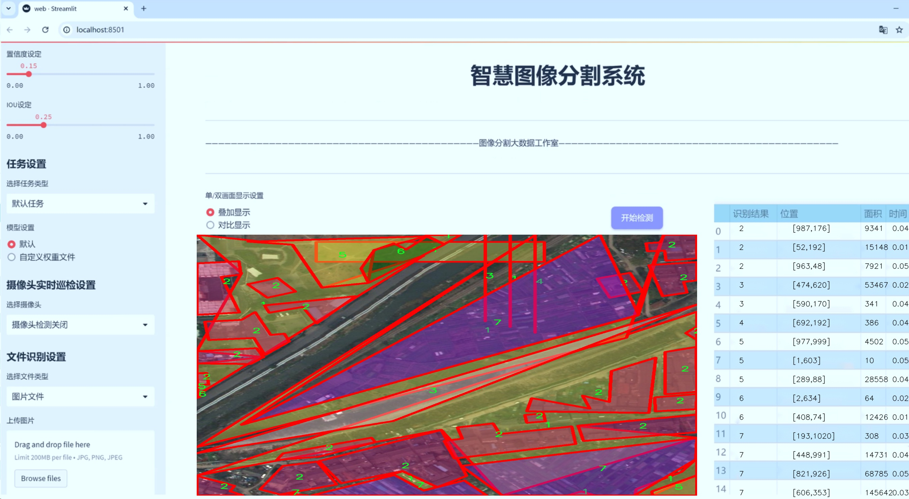
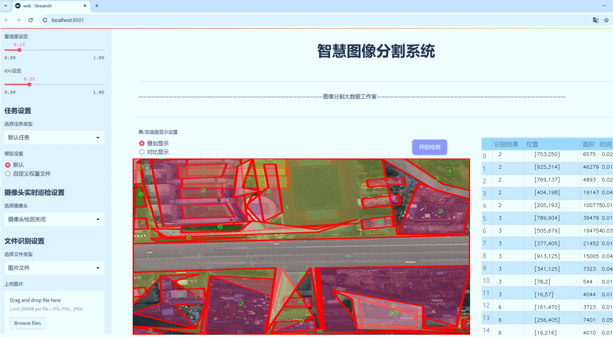
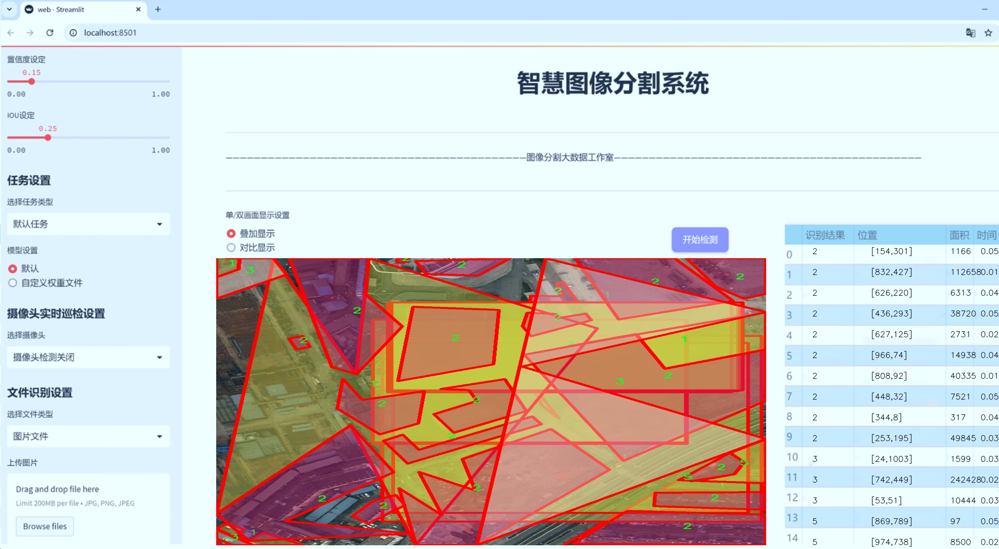
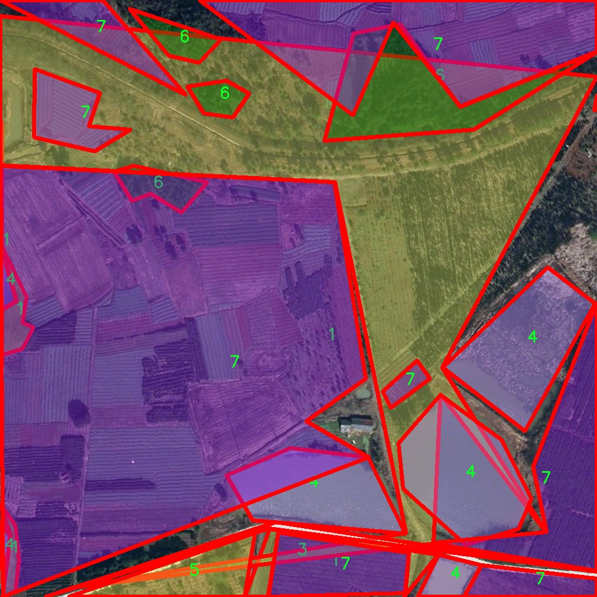
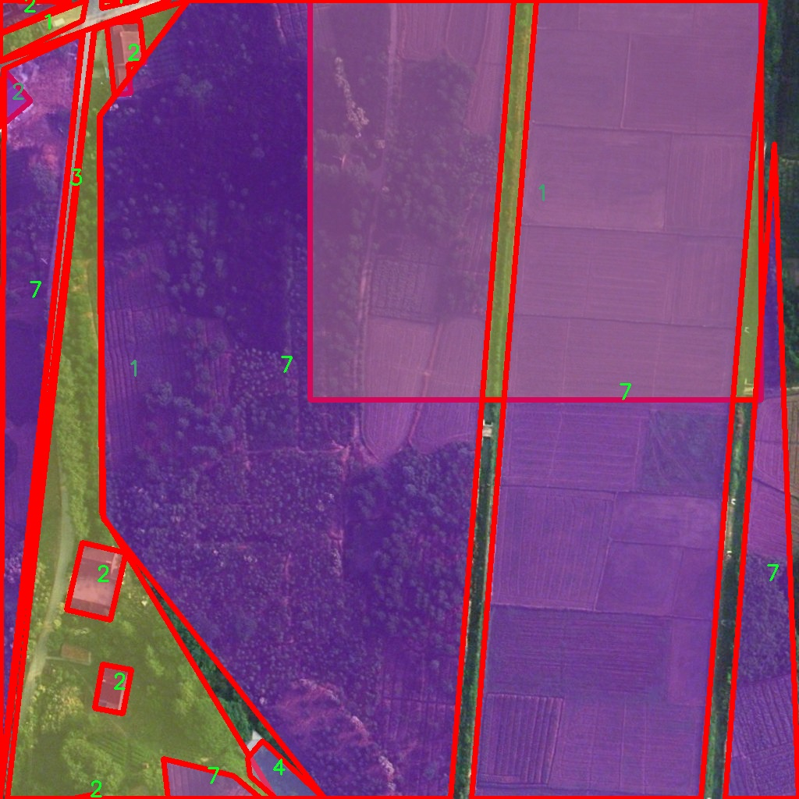
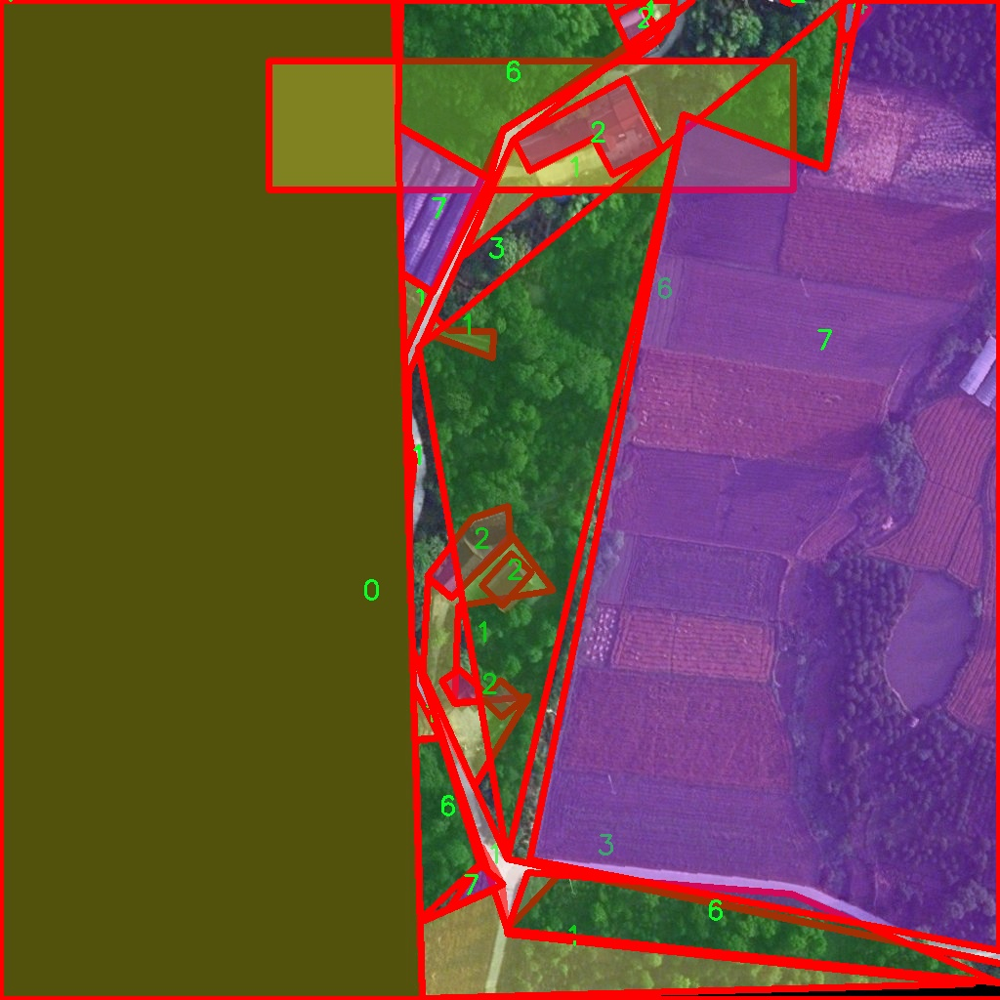
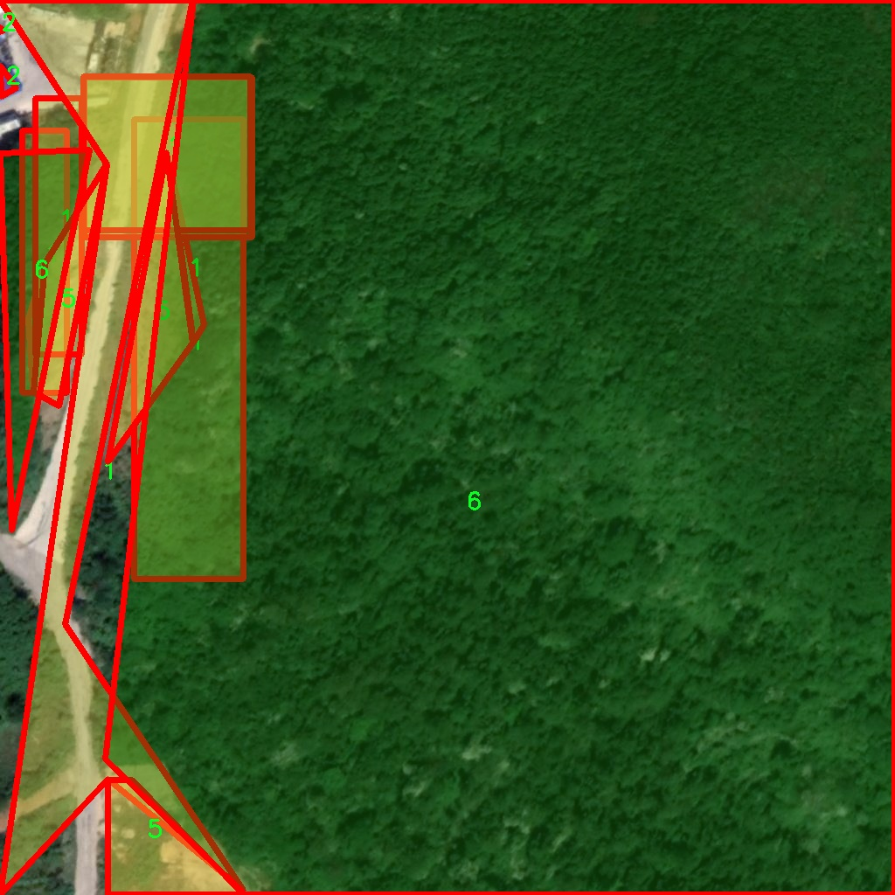
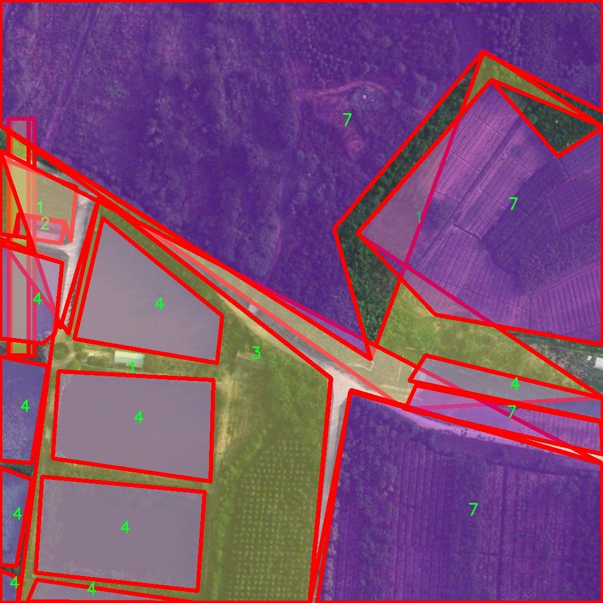

# 土地覆盖类型分割系统： yolov8-seg-C2f-SCcConv

### 1.研究背景与意义

[参考博客](https://gitee.com/YOLOv8_YOLOv11_Segmentation_Studio/projects)

[博客来源](https://kdocs.cn/l/cszuIiCKVNis)

研究背景与意义

随着全球城市化进程的加速，土地利用和覆盖变化已成为影响生态环境和社会经济发展的重要因素。土地覆盖类型的准确识别与分类不仅对于城市规划、资源管理和环境保护具有重要意义，同时也是遥感、地理信息系统（GIS）等领域研究的核心内容之一。传统的土地覆盖分类方法多依赖于人工解译和简单的图像处理技术，存在效率低、准确性差等问题。近年来，深度学习技术的迅猛发展为土地覆盖类型的自动化识别提供了新的解决方案，其中基于卷积神经网络（CNN）的目标检测和分割模型表现出色。

YOLO（You Only Look Once）系列模型因其高效的实时目标检测能力而广受欢迎。YOLOv8作为该系列的最新版本，结合了多种先进的深度学习技术，能够在保证检测精度的同时，显著提高处理速度。然而，尽管YOLOv8在一般目标检测任务中表现优异，但在土地覆盖类型分割的特定应用场景中，仍存在一定的局限性，如对复杂背景的适应性不足、细粒度分类能力欠缺等。因此，基于改进YOLOv8的土地覆盖类型分割系统的研究显得尤为重要。

本研究将基于一个包含3800幅图像和8个类别的土地覆盖数据集，构建一个高效的土地覆盖类型分割系统。该数据集涵盖了多种土地覆盖类型，包括城市、森林、农田、水体等，能够为模型的训练和验证提供丰富的样本。这一数据集的多样性和复杂性将为模型的泛化能力和鲁棒性提出挑战，同时也为研究者提供了良好的实验基础。

通过对YOLOv8模型的改进，我们将重点关注如何提升其在土地覆盖类型分割任务中的表现。具体而言，研究将探索改进特征提取网络、优化损失函数以及增强数据预处理等策略，以提高模型对不同土地覆盖类型的识别精度。此外，针对土地覆盖类型分割的特点，研究还将引入实例分割的思想，力求在分割精度和计算效率之间取得平衡。

本研究的意义不仅在于推动土地覆盖类型分割技术的发展，更在于为相关领域的应用提供切实可行的解决方案。通过实现高效、准确的土地覆盖类型分割系统，研究将为城市规划、环境监测和资源管理等提供重要的数据支持和决策依据。此外，研究成果还将为深度学习在遥感图像处理中的应用提供新的思路和方法，推动相关技术的进一步发展。

综上所述，基于改进YOLOv8的土地覆盖类型分割系统的研究，既是对现有技术的创新与突破，也是对实际应用需求的积极响应，具有重要的理论价值和现实意义。通过深入探讨和实验验证，本研究期望为土地覆盖类型的精确识别与分类提供新的视角和方法，为可持续发展和生态环境保护贡献力量。

### 2.图片演示







注意：本项目提供完整的训练源码数据集和训练教程,由于此博客编辑较早,暂不提供权重文件（best.pt）,需要按照6.训练教程进行训练后实现上图效果。

### 3.视频演示

[3.1 视频演示](https://www.bilibili.com/video/BV1wUztYpEEp/)

### 4.数据集信息

##### 4.1 数据集类别数＆类别名

nc: 8
names: ['0', '1', '2', '3', '4', '5', '6', '7']


##### 4.2 数据集信息简介

数据集信息展示

在本研究中，我们使用了名为“Land Segmentation”的数据集，以训练和改进YOLOv8-seg模型，旨在实现高效的土地覆盖类型分割。该数据集包含八个不同的类别，分别标记为‘0’到‘7’，这些类别代表了不同的土地覆盖类型。这种细致的分类对于理解和分析土地利用变化、城市扩展、农业发展以及生态保护等方面具有重要意义。

“Land Segmentation”数据集的设计初衷是为了提供一个多样化且具有代表性的样本集合，使得模型能够在各种实际场景中表现出色。每个类别都涵盖了特定的土地覆盖类型，例如城市区域、农田、森林、水体等。这些类别的划分不仅考虑了土地的物理特征，还结合了人类活动对土地的影响，从而使得数据集在现实应用中具有更高的实用价值。

在数据集的构建过程中，研究团队采用了多种数据采集技术，包括遥感影像、无人机航拍以及地面实地调查等。这些方法确保了数据的准确性和多样性，使得每个类别的样本都能够充分代表其特征。此外，数据集中的图像经过精心标注，确保了每个像素的分类准确性，为后续的模型训练提供了坚实的基础。

为了提高模型的泛化能力，数据集还进行了多种数据增强处理。这些处理包括旋转、缩放、翻转以及颜色调整等，旨在模拟不同的环境条件和光照变化，从而增强模型对各种土地覆盖类型的识别能力。这种多样化的训练数据将帮助YOLOv8-seg模型更好地适应实际应用中的复杂情况，提高其在土地覆盖类型分割任务中的准确性和鲁棒性。

在训练过程中，我们将数据集划分为训练集、验证集和测试集，以便于模型的评估和优化。训练集用于模型的学习，验证集用于调整模型参数，而测试集则用于最终的性能评估。通过这种方式，我们能够全面了解模型在不同数据集上的表现，从而确保其在实际应用中的可靠性。

此外，数据集的类别数量和类别名称的设计也为模型的训练提供了清晰的方向。每个类别的标识符从‘0’到‘7’不仅简洁明了，还为后续的模型输出提供了方便的映射关系。这种清晰的分类结构使得模型在进行土地覆盖类型分割时，能够快速而准确地识别出不同的土地类型，从而为土地管理、环境监测和城市规划等领域提供有力的支持。

综上所述，“Land Segmentation”数据集为改进YOLOv8-seg的土地覆盖类型分割系统提供了丰富的资源和坚实的基础。通过对数据集的深入分析和有效利用，我们期望能够实现更高精度的土地覆盖类型识别，为相关领域的研究和应用提供更为可靠的技术支持。











### 5.项目依赖环境部署教程（零基础手把手教学）

[5.1 环境部署教程链接（零基础手把手教学）](https://www.bilibili.com/video/BV1jG4Ve4E9t/?vd_source=bc9aec86d164b67a7004b996143742dc)


[5.2 安装Python虚拟环境创建和依赖库安装视频教程链接（零基础手把手教学）](https://www.bilibili.com/video/BV1nA4VeYEze/?vd_source=bc9aec86d164b67a7004b996143742dc)

### 6.手把手YOLOV8-seg训练视频教程（零基础手把手教学）

[6.1 手把手YOLOV8-seg训练视频教程（零基础小白有手就能学会）](https://www.bilibili.com/video/BV1cA4VeYETe/?vd_source=bc9aec86d164b67a7004b996143742dc)


按照上面的训练视频教程链接加载项目提供的数据集，运行train.py即可开始训练



     Epoch   gpu_mem       box       obj       cls    labels  img_size
     1/200     0G   0.01576   0.01955  0.007536        22      1280: 100%|██████████| 849/849 [14:42<00:00,  1.04s/it]
               Class     Images     Labels          P          R     mAP@.5 mAP@.5:.95: 100%|██████████| 213/213 [01:14<00:00,  2.87it/s]
                 all       3395      17314      0.994      0.957      0.0957      0.0843

     Epoch   gpu_mem       box       obj       cls    labels  img_size
     2/200     0G   0.01578   0.01923  0.007006        22      1280: 100%|██████████| 849/849 [14:44<00:00,  1.04s/it]
               Class     Images     Labels          P          R     mAP@.5 mAP@.5:.95: 100%|██████████| 213/213 [01:12<00:00,  2.95it/s]
                 all       3395      17314      0.996      0.956      0.0957      0.0845

     Epoch   gpu_mem       box       obj       cls    labels  img_size
     3/200     0G   0.01561    0.0191  0.006895        27      1280: 100%|██████████| 849/849 [10:56<00:00,  1.29it/s]
               Class     Images     Labels          P          R     mAP@.5 mAP@.5:.95: 100%|███████   | 187/213 [00:52<00:00,  4.04it/s]
                 all       3395      17314      0.996      0.957      0.0957      0.0845


### 7.50+种全套YOLOV8-seg创新点加载调参实验视频教程（一键加载写好的改进模型的配置文件）

[7.1 50+种全套YOLOV8-seg创新点加载调参实验视频教程（一键加载写好的改进模型的配置文件）](https://www.bilibili.com/video/BV1Hw4VePEXv/?vd_source=bc9aec86d164b67a7004b996143742dc)

### YOLOV8-seg算法简介

原始YOLOv8-seg算法原理

YOLOv8-seg算法是YOLO系列中的最新版本，专注于目标检测与实例分割任务。作为一个集成了多种先进技术的模型，YOLOv8-seg在设计上融合了YOLOv5、YOLOv6、YOLOv7等前辈模型的优点，同时也引入了新的结构和方法，以提升模型的性能和实用性。其核心原理围绕着输入层、主干网络、颈部网络和头部网络的多层次结构展开，形成了一个高效的特征提取与处理框架。

在YOLOv8-seg的工作流程中，首先是输入层的图像预处理。输入图像会被缩放到特定的尺寸，以满足模型的输入要求。这一过程确保了模型在处理不同分辨率图像时的统一性和稳定性。接下来，主干网络通过一系列卷积操作对图像进行下采样，以提取出重要的特征信息。每个卷积层都结合了批归一化和SiLUR激活函数，这不仅加速了训练过程，还提高了模型的非线性表达能力。

主干网络中的C2f块是YOLOv8-seg的一大创新。该模块借鉴了YOLOv7中的E-ELAN结构，通过跨层分支连接来增强模型的梯度流动。这种设计使得特征的传递更加高效，进而改善了检测和分割的效果。C2f块的引入，标志着YOLOv8-seg在特征提取阶段的显著提升，使得模型能够更好地捕捉到复杂场景中的细节信息。

在主干网络的末尾，SPPFl块的设计则是为了处理多尺度特征。通过三个最大池化层的组合，SPPFl块能够有效地增强网络的特征抽象能力，使得模型在面对不同大小的目标时，依然能够保持较高的识别精度。这一模块的存在，极大地丰富了YOLOv8-seg的特征表达能力，为后续的特征融合打下了坚实的基础。

颈部网络是YOLOv8-seg的另一个关键组成部分。它采用了FPNS（特征金字塔网络）和PAN（路径聚合网络）结构，旨在融合来自不同尺度的特征图信息。通过这些结构，YOLOv8-seg能够有效地整合来自主干网络的多层次特征，形成更加全面的特征表示。这种特征融合的方式，确保了模型在进行目标检测和实例分割时，能够充分利用不同层次的特征信息，从而提升整体的检测精度。

最后，YOLOv8-seg的头部网络采用了解耦的检测头设计。与传统的耦合头不同，解耦头通过两个并行的卷积分支分别计算回归和类别的损失。这一设计的优势在于，它能够独立优化分类和回归任务，从而提升模型的整体性能。此外，YOLOv8-seg还引入了Anchor-Free的检测机制，去除了之前的objectness分支，使得模型在处理目标时更加灵活高效。

YOLOv8-seg的创新之处不仅体现在结构设计上，还包括其在损失函数的改进。这种新型损失函数的引入，使得模型在训练过程中能够更好地适应不同类型的目标，尤其是在小目标检测和高分辨率图像处理方面，表现出色。这一系列的改进，使得YOLOv8-seg在计算机视觉领域中脱颖而出，成为当前最先进的目标检测与实例分割模型之一。

综上所述，YOLOv8-seg算法通过其独特的多层次结构设计、创新的特征提取与融合方法，以及解耦的检测头，展现了在目标检测与实例分割任务中的强大能力。其高效的特征处理流程和灵活的损失优化机制，使得YOLOv8-seg在实际应用中具备了极高的精度和速度，为各类计算机视觉任务提供了有力的支持。随着YOLOv8-seg的不断发展与完善，未来其在更广泛的应用场景中必将发挥更大的作用，推动目标检测与实例分割技术的进一步进步。


### 9.系统功能展示（检测对象为举例，实际内容以本项目数据集为准）

图9.1.系统支持检测结果表格显示

  图9.2.系统支持置信度和IOU阈值手动调节

  图9.3.系统支持自定义加载权重文件best.pt(需要你通过步骤5中训练获得)

  图9.4.系统支持摄像头实时识别

  图9.5.系统支持图片识别

  图9.6.系统支持视频识别

  图9.7.系统支持识别结果文件自动保存

  图9.8.系统支持Excel导出检测结果数据


### 10.50+种全套YOLOV8-seg创新点原理讲解（非科班也可以轻松写刊发刊，V11版本正在科研待更新）

#### 10.1 由于篇幅限制，每个创新点的具体原理讲解就不一一展开，具体见下列网址中的创新点对应子项目的技术原理博客网址【Blog】：


[10.1 50+种全套YOLOV8-seg创新点原理讲解链接](https://gitee.com/qunmasj/good)

#### 10.2 部分改进模块原理讲解(完整的改进原理见上图和技术博客链接)【如果此小节的图加载失败可以通过CSDN或者Github搜索该博客的标题访问原始博客，原始博客图片显示正常】

### YOLOv8简介

按照官方描述，YOLOv8 是一个 SOTA 模型，它建立在以前 YOLO 版本的成功基础上，并引入了新的功能和改进，以进一步提升性能和灵活性。具体创新包括一个新的骨干网络、一个新的 Ancher-Free 检测头和一个新的损失函数，可以在从 CPU 到 GPU 的各种硬件平台上运行。

不过 ultralytics 并没有直接将开源库命名为 YOLOv8，而是直接使用 ultralytics 这个词，原因是 ultralytics 将这个库定位为算法框架，而非某一个特定算法，一个主要特点是可扩展性。其希望这个库不仅仅能够用于 YOLO 系列模型，而是能够支持非 YOLO 模型以及分类分割姿态估计等各类任务。
总而言之，ultralytics 开源库的两个主要优点是：

融合众多当前 SOTA 技术于一体
未来将支持其他 YOLO 系列以及 YOLO 之外的更多算法


下表为官方在 COCO Val 2017 数据集上测试的 mAP、参数量和 FLOPs 结果。可以看出 YOLOv8 相比 YOLOv5 精度提升非常多，但是 N/S/M 模型相应的参数量和 FLOPs 都增加了不少，从上图也可以看出相比 YOLOV5 大部分模型推理速度变慢了。


额外提一句，现在各个 YOLO 系列改进算法都在 COCO 上面有明显性能提升，但是在自定义数据集上面的泛化性还没有得到广泛验证，至今依然听到不少关于 YOLOv5 泛化性能较优异的说法。对各系列 YOLO 泛化性验证也是 MMYOLO 中一个特别关心和重点发力的方向。

### YOLO-MS简介
实时目标检测，以YOLO系列为例，已在工业领域中找到重要应用，特别是在边缘设备（如无人机和机器人）中。与之前的目标检测器不同，实时目标检测器旨在在速度和准确性之间追求最佳平衡。为了实现这一目标，提出了大量的工作：从第一代DarkNet到CSPNet，再到最近的扩展ELAN，随着性能的快速增长，实时目标检测器的架构经历了巨大的变化。

尽管性能令人印象深刻，但在不同尺度上识别对象仍然是实时目标检测器面临的基本挑战。这促使作者设计了一个强大的编码器架构，用于学习具有表现力的多尺度特征表示。具体而言，作者从两个新的角度考虑为实时目标检测编码多尺度特征：

从局部视角出发，作者设计了一个具有简单而有效的分层特征融合策略的MS-Block。受到Res2Net的启发，作者在MS-Block中引入了多个分支来进行特征提取，但不同的是，作者使用了一个带有深度卷积的 Inverted Bottleneck Block块，以实现对大Kernel的高效利用。

从全局视角出发，作者提出随着网络加深逐渐增加卷积的Kernel-Size。作者在浅层使用小Kernel卷积来更高效地处理高分辨率特征。另一方面，在深层中，作者采用大Kernel卷积来捕捉广泛的信息。

基于以上设计原则，作者呈现了作者的实时目标检测器，称为YOLO-MS。为了评估作者的YOLO-MS的性能，作者在MS COCO数据集上进行了全面的实验。还提供了与其他最先进方法的定量比较，以展示作者方法的强大性能。如图1所示，YOLO-MS在计算性能平衡方面优于其他近期的实时目标检测器。


具体而言，YOLO-MS-XS在MS COCO上获得了43%+的AP得分，仅具有450万个可学习参数和8.7亿个FLOPs。YOLO-MS-S和YOLO-MS分别获得了46%+和51%+的AP，可学习参数分别为810万和2220万。此外，作者的工作还可以作为其他YOLO模型的即插即用模块。通常情况下，作者的方法可以将YOLOv8的AP从37%+显著提高到40%+，甚至还可以使用更少的参数和FLOPs。


#### Multi-Scale Building Block Design
CSP Block是一个基于阶段级梯度路径的网络，平衡了梯度组合和计算成本。它是广泛应用于YOLO系列的基本构建块。已经提出了几种变体，包括YOLOv4和YOLOv5中的原始版本，Scaled YOLOv4中的CSPVoVNet，YOLOv7中的ELAN，以及RTMDet中提出的大Kernel单元。作者在图2(a)和图2(b)中分别展示了原始CSP块和ELAN的结构。


上述实时检测器中被忽视的一个关键方面是如何在基本构建块中编码多尺度特征。其中一个强大的设计原则是Res2Net，它聚合了来自不同层次的特征以增强多尺度表示。然而，这一原则并没有充分探索大Kernel卷积的作用，而大Kernel卷积已经在基于CNN的视觉识别任务模型中证明有效。将大Kernel卷积纳入Res2Net的主要障碍在于它们引入的计算开销，因为构建块采用了标准卷积。在作者的方法中，作者提出用 Inverted Bottleneck Block替代标准的3 × 3卷积，以享受大Kernel卷积的好处。

基于前面的分析，作者提出了一个带有分层特征融合策略的全新Block，称为MS-Block，以增强实时目标检测器在提取多尺度特征时的能力，同时保持快速的推理速度。

MS-Block的具体结构如图2(c)所示。假设是输入特征。通过1×1卷积的转换后，X的通道维度增加到n*C。然后，作者将X分割成n个不同的组，表示为，其中。为了降低计算成本，作者选择n为3。

注意，除了之外，每个其他组都经过一个 Inverted Bottleneck Block层，用表示，其中k表示Kernel-Size，以获得。的数学表示如下：


根据这个公式，该博客的作者不将 Inverted Bottleneck Block层连接，使其作为跨阶段连接，并保留来自前面层的信息。最后，作者将所有分割连接在一起，并应用1×1卷积来在所有分割之间进行交互，每个分割都编码不同尺度的特征。当网络加深时，这个1×1卷积也用于调整通道数。

#### Heterogeneous Kernel Selection Protocol
除了构建块的设计外，作者还从宏观角度探讨了卷积的使用。之前的实时目标检测器在不同的编码器阶段采用了同质卷积（即具有相同Kernel-Size的卷积），但作者认为这不是提取多尺度语义信息的最佳选项。

在金字塔结构中，从检测器的浅阶段提取的高分辨率特征通常用于捕捉细粒度语义，将用于检测小目标。相反，来自网络较深阶段的低分辨率特征用于捕捉高级语义，将用于检测大目标。如果作者在所有阶段都采用统一的小Kernel卷积，深阶段的有效感受野（ERF）将受到限制，影响大目标的性能。在每个阶段中引入大Kernel卷积可以帮助解决这个问题。然而，具有大的ERF的大Kernel可以编码更广泛的区域，这增加了在小目标外部包含噪声信息的概率，并且降低了推理速度。

在这项工作中，作者建议在不同阶段中采用异构卷积，以帮助捕获更丰富的多尺度特征。具体来说，在编码器的第一个阶段中，作者采用最小Kernel卷积，而最大Kernel卷积位于最后一个阶段。随后，作者逐步增加中间阶段的Kernel-Size，使其与特征分辨率的增加保持一致。这种策略允许提取细粒度和粗粒度的语义信息，增强了编码器的多尺度特征表示能力。

正如图所示，作者将k的值分别分配给编码器中的浅阶段到深阶段，取值为3、5、7和9。作者将其称为异构Kernel选择（HKS）协议。


作者的HKS协议能够在深层中扩大感受野，而不会对浅层产生任何其他影响。此外，HKS不仅有助于编码更丰富的多尺度特征，还确保了高效的推理。

如表1所示，将大Kernel卷积应用于高分辨率特征会产生较高的计算开销。然而，作者的HKS协议在低分辨率特征上采用大Kernel卷积，从而与仅使用大Kernel卷积相比，大大降低了计算成本。


在实践中，作者经验性地发现，采用HKS协议的YOLO-MS的推理速度几乎与仅使用深度可分离的3 × 3卷积相同。

#### Architecture
如图所示，作者模型的Backbone由4个阶段组成，每个阶段后面跟随1个步长为2的3 × 3卷积进行下采样。在第3个阶段后，作者添加了1个SPP块，与RTMDet中一样。在作者的编码器上，作者使用PAFPN作为Neck来构建特征金字塔[31, 35]。它融合了从Backbone不同阶段提取的多尺度特征。Neck中使用的基本构建块也是作者的MS-Block，在其中使用3 × 3深度可分离卷积进行快速推理。

此外，为了在速度和准确性之间取得更好的平衡，作者将Backbone中多级特征的通道深度减半。作者提供了3个不同尺度的YOLO-MS变体，即YOLO-MS-XS、YOLO-MS-S和YOLO-MS。不同尺度的YOLO-MS的详细配置列在表2中。对于YOLO-MS的其他部分，作者将其保持与RTMDet相同。


### 11.项目核心源码讲解（再也不用担心看不懂代码逻辑）

#### 11.1 demo_test_camera.py

以下是对给定代码的核心部分进行分析和详细注释的结果：

```python
import cv2
import numpy as np
from PIL import ImageFont, ImageDraw, Image
from hashlib import md5
from model import Web_Detector
from chinese_name_list import Label_list

def generate_color_based_on_name(name):
    """
    根据名称生成稳定的颜色
    :param name: 输入的名称字符串
    :return: 生成的颜色，格式为BGR
    """
    hash_object = md5(name.encode())  # 使用MD5哈希函数
    hex_color = hash_object.hexdigest()[:6]  # 取前6位16进制数
    r, g, b = int(hex_color[0:2], 16), int(hex_color[2:4], 16), int(hex_color[4:6], 16)
    return (b, g, r)  # OpenCV使用BGR格式

def draw_with_chinese(image, text, position, font_size=20, color=(255, 0, 0)):
    """
    在图像上绘制中文文本
    :param image: 输入图像
    :param text: 要绘制的文本
    :param position: 文本位置
    :param font_size: 字体大小
    :param color: 文本颜色
    :return: 绘制文本后的图像
    """
    image_pil = Image.fromarray(cv2.cvtColor(image, cv2.COLOR_BGR2RGB))  # 转换为PIL格式
    draw = ImageDraw.Draw(image_pil)  # 创建绘图对象
    font = ImageFont.truetype("simsun.ttc", font_size, encoding="unic")  # 加载字体
    draw.text(position, text, font=font, fill=color)  # 绘制文本
    return cv2.cvtColor(np.array(image_pil), cv2.COLOR_RGB2BGR)  # 转换回OpenCV格式

def draw_detections(image, info):
    """
    在图像上绘制检测结果，包括边框、类别名称等
    :param image: 输入图像
    :param info: 检测信息，包括类别名称、边界框、置信度等
    :return: 绘制后的图像
    """
    name, bbox = info['class_name'], info['bbox']  # 提取检测信息
    x1, y1, x2, y2 = bbox  # 边界框坐标
    cv2.rectangle(image, (x1, y1), (x2, y2), color=(0, 0, 255), thickness=3)  # 绘制边界框
    image = draw_with_chinese(image, name, (x1, y1 - 10), font_size=20)  # 绘制类别名称
    return image

def process_frame(model, image):
    """
    处理单帧图像，进行目标检测
    :param model: 目标检测模型
    :param image: 输入图像
    :return: 处理后的图像
    """
    pre_img = model.preprocess(image)  # 预处理图像
    pred = model.predict(pre_img)  # 进行预测
    det = pred[0]  # 获取检测结果

    if det is not None and len(det):
        det_info = model.postprocess(pred)  # 后处理获取检测信息
        for info in det_info:
            image = draw_detections(image, info)  # 绘制检测结果
    return image

if __name__ == "__main__":
    model = Web_Detector()  # 初始化模型
    model.load_model("./weights/yolov8s-seg.pt")  # 加载模型权重

    # 摄像头实时处理
    cap = cv2.VideoCapture(0)  # 打开摄像头
    while cap.isOpened():
        ret, frame = cap.read()  # 读取帧
        if not ret:
            break
        processed_frame = process_frame(model, frame)  # 处理帧
        cv2.imshow('Camera Feed', processed_frame)  # 显示处理后的帧
        if cv2.waitKey(1) & 0xFF == ord('q'):  # 按'q'退出
            break
    cap.release()  # 释放摄像头
    cv2.destroyAllWindows()  # 关闭所有窗口
```

### 核心部分分析
1. **生成颜色**：`generate_color_based_on_name`函数通过MD5哈希生成稳定的颜色，确保相同的名称总是得到相同的颜色。
2. **绘制中文文本**：`draw_with_chinese`函数利用PIL库在图像上绘制中文文本，支持指定位置、字体大小和颜色。
3. **绘制检测结果**：`draw_detections`函数负责在图像上绘制检测到的物体的边界框和类别名称。
4. **处理图像帧**：`process_frame`函数将输入图像传递给模型进行处理，并将检测结果绘制到图像上。
5. **实时摄像头处理**：主程序部分实现了实时从摄像头读取图像并进行处理，直到用户按下'q'键退出。

以上是对代码的核心部分进行了提炼和详细注释，确保理解其功能和实现逻辑。

这个程序文件 `demo_test_camera.py` 是一个用于实时视频处理的脚本，主要功能是通过摄像头捕捉视频流，并利用深度学习模型进行目标检测和分割。以下是对代码的逐步分析和说明。

首先，程序导入了一些必要的库，包括 `random`、`cv2`（OpenCV库）、`numpy`、`PIL`（用于处理图像）、`hashlib`（用于生成哈希值）、以及自定义的 `Web_Detector` 模型和 `Label_list` 标签列表。

接下来，定义了一个 `generate_color_based_on_name` 函数，该函数使用 MD5 哈希算法根据给定的名称生成一个稳定的颜色值。这个颜色值以 BGR 格式返回，适合 OpenCV 使用。

`calculate_polygon_area` 函数用于计算多边形的面积，利用 OpenCV 的 `contourArea` 函数。

`draw_with_chinese` 函数用于在图像上绘制中文文本。它将 OpenCV 图像转换为 PIL 图像，使用指定的字体和颜色在指定位置绘制文本，然后再转换回 OpenCV 格式。

`adjust_parameter` 函数根据图像的大小调整参数，以便在绘制时保持适当的比例。

`draw_detections` 函数是程序的核心部分，负责在图像上绘制检测到的目标。它根据目标的边界框（bbox）和掩码（mask）来绘制矩形框和分割区域。如果存在掩码，则计算多边形的面积、周长和圆度，并从图像中随机选择一些点来计算颜色值。最后，将这些信息（如面积、周长、圆度和颜色）绘制到图像上。

`process_frame` 函数用于处理每一帧图像。它首先对图像进行预处理，然后使用模型进行预测，并将检测到的信息传递给 `draw_detections` 函数进行绘制。

在 `__main__` 块中，程序首先加载标签列表和目标检测模型。接着，通过 OpenCV 打开摄像头，进入一个循环，不断读取摄像头帧并进行处理。处理后的帧通过 `cv2.imshow` 显示在窗口中，用户可以通过按下 'q' 键退出循环。

最后，程序释放摄像头资源并关闭所有 OpenCV 窗口。

总体来说，这个程序实现了一个实时目标检测和分割的应用，能够在视频流中标记出检测到的物体，并显示相关的统计信息。

#### 11.2 ultralytics\models\yolo\classify\predict.py

以下是经过简化和注释的核心代码部分：

```python
import torch
from ultralytics.engine.predictor import BasePredictor
from ultralytics.engine.results import Results
from ultralytics.utils import DEFAULT_CFG, ops

class ClassificationPredictor(BasePredictor):
    """
    ClassificationPredictor类用于基于分类模型进行预测。
    该类继承自BasePredictor类。
    """

    def __init__(self, cfg=DEFAULT_CFG, overrides=None, _callbacks=None):
        """初始化ClassificationPredictor，将任务设置为'分类'。"""
        super().__init__(cfg, overrides, _callbacks)  # 调用父类构造函数
        self.args.task = 'classify'  # 设置任务类型为分类

    def preprocess(self, img):
        """将输入图像转换为模型兼容的数据类型。"""
        # 如果输入不是torch.Tensor类型，则将其转换为Tensor
        if not isinstance(img, torch.Tensor):
            img = torch.stack([self.transforms(im) for im in img], dim=0)  # 应用预处理转换
        # 将图像移动到模型所在的设备（CPU或GPU）
        img = (img if isinstance(img, torch.Tensor) else torch.from_numpy(img)).to(self.model.device)
        # 根据模型的精度设置返回图像类型（fp16或fp32）
        return img.half() if self.model.fp16 else img.float()  # uint8转换为fp16/32

    def postprocess(self, preds, img, orig_imgs):
        """对预测结果进行后处理，返回Results对象。"""
        # 如果原始图像不是列表，则将其转换为numpy数组
        if not isinstance(orig_imgs, list):
            orig_imgs = ops.convert_torch2numpy_batch(orig_imgs)

        results = []  # 存储结果的列表
        for i, pred in enumerate(preds):  # 遍历每个预测结果
            orig_img = orig_imgs[i]  # 获取对应的原始图像
            img_path = self.batch[0][i]  # 获取图像路径
            # 创建Results对象并添加到结果列表中
            results.append(Results(orig_img, path=img_path, names=self.model.names, probs=pred))
        return results  # 返回处理后的结果列表
```

### 代码说明：
1. **导入必要的库**：引入了PyTorch和Ultralytics相关的模块。
2. **ClassificationPredictor类**：该类用于进行图像分类预测，继承自`BasePredictor`。
3. **构造函数`__init__`**：初始化时设置任务类型为分类。
4. **`preprocess`方法**：负责将输入图像转换为模型可以处理的格式，包括类型转换和设备转移。
5. **`postprocess`方法**：对模型的预测结果进行后处理，生成`Results`对象以便于后续使用。

这个程序文件是Ultralytics YOLO框架中的一个分类预测模块，主要用于基于分类模型进行图像分类预测。文件中定义了一个名为`ClassificationPredictor`的类，该类继承自`BasePredictor`，并专门处理图像分类任务。

在类的构造函数`__init__`中，首先调用父类的构造函数进行初始化，并将任务类型设置为“classify”，表示该预测器将用于分类任务。可以通过`overrides`参数传入特定的配置选项。

`preprocess`方法负责对输入图像进行预处理，以确保其符合模型的输入要求。该方法首先检查输入是否为PyTorch张量，如果不是，则将输入图像转换为张量格式。接着，将图像移动到模型所在的设备上（如GPU），并根据模型的精度要求将数据类型转换为半精度（fp16）或单精度（fp32）。

`postprocess`方法用于对模型的预测结果进行后处理，以返回包含预测结果的`Results`对象。该方法首先检查原始图像是否为列表格式，如果不是，则将其转换为NumPy数组格式。然后，遍历每个预测结果，将其与对应的原始图像和图像路径结合，创建`Results`对象并存储在结果列表中，最终返回这个结果列表。

整个模块的设计使得用户可以方便地使用预训练的YOLO模型或Torchvision的分类模型进行图像分类，并能够处理输入和输出的格式，以便于后续的分析和使用。使用示例中展示了如何实例化`ClassificationPredictor`并调用其`predict_cli`方法进行预测。

#### 11.3 ultralytics\models\yolo\classify\val.py

以下是代码中最核心的部分，并附上详细的中文注释：

```python
import torch
from ultralytics.data import ClassificationDataset, build_dataloader
from ultralytics.engine.validator import BaseValidator
from ultralytics.utils.metrics import ClassifyMetrics, ConfusionMatrix
from ultralytics.utils.plotting import plot_images

class ClassificationValidator(BaseValidator):
    """
    ClassificationValidator类，继承自BaseValidator，用于基于分类模型的验证。
    """

    def __init__(self, dataloader=None, save_dir=None, pbar=None, args=None, _callbacks=None):
        """初始化ClassificationValidator实例，设置数据加载器、保存目录、进度条和参数。"""
        super().__init__(dataloader, save_dir, pbar, args, _callbacks)
        self.targets = None  # 存储真实标签
        self.pred = None     # 存储模型预测结果
        self.args.task = 'classify'  # 设置任务类型为分类
        self.metrics = ClassifyMetrics()  # 初始化分类指标

    def init_metrics(self, model):
        """初始化混淆矩阵、类名以及top-1和top-5准确率。"""
        self.names = model.names  # 获取模型的类名
        self.nc = len(model.names)  # 类别数量
        self.confusion_matrix = ConfusionMatrix(nc=self.nc, conf=self.args.conf, task='classify')  # 初始化混淆矩阵
        self.pred = []  # 预测结果列表
        self.targets = []  # 真实标签列表

    def preprocess(self, batch):
        """预处理输入批次并返回处理后的批次。"""
        batch['img'] = batch['img'].to(self.device, non_blocking=True)  # 将图像移动到设备上
        batch['img'] = batch['img'].half() if self.args.half else batch['img'].float()  # 根据参数选择数据类型
        batch['cls'] = batch['cls'].to(self.device)  # 将标签移动到设备上
        return batch

    def update_metrics(self, preds, batch):
        """使用模型预测和批次目标更新运行指标。"""
        n5 = min(len(self.names), 5)  # 获取前5个预测
        self.pred.append(preds.argsort(1, descending=True)[:, :n5])  # 记录预测结果
        self.targets.append(batch['cls'])  # 记录真实标签

    def finalize_metrics(self, *args, **kwargs):
        """最终化模型的指标，如混淆矩阵和速度。"""
        self.confusion_matrix.process_cls_preds(self.pred, self.targets)  # 处理预测和真实标签以更新混淆矩阵
        self.metrics.speed = self.speed  # 记录速度
        self.metrics.confusion_matrix = self.confusion_matrix  # 记录混淆矩阵

    def get_stats(self):
        """返回通过处理目标和预测获得的指标字典。"""
        self.metrics.process(self.targets, self.pred)  # 处理真实标签和预测结果
        return self.metrics.results_dict  # 返回结果字典

    def build_dataset(self, img_path):
        """创建并返回一个ClassificationDataset实例，使用给定的图像路径和预处理参数。"""
        return ClassificationDataset(root=img_path, args=self.args, augment=False, prefix=self.args.split)

    def get_dataloader(self, dataset_path, batch_size):
        """构建并返回用于分类任务的数据加载器。"""
        dataset = self.build_dataset(dataset_path)  # 构建数据集
        return build_dataloader(dataset, batch_size, self.args.workers, rank=-1)  # 返回数据加载器

    def print_results(self):
        """打印YOLO模型的评估指标。"""
        pf = '%22s' + '%11.3g' * len(self.metrics.keys)  # 打印格式
        LOGGER.info(pf % ('all', self.metrics.top1, self.metrics.top5))  # 打印top-1和top-5准确率

    def plot_val_samples(self, batch, ni):
        """绘制验证图像样本。"""
        plot_images(
            images=batch['img'],
            batch_idx=torch.arange(len(batch['img'])),
            cls=batch['cls'].view(-1),  # 使用.view()而不是.squeeze()以适应分类模型
            fname=self.save_dir / f'val_batch{ni}_labels.jpg',
            names=self.names,
            on_plot=self.on_plot)

    def plot_predictions(self, batch, preds, ni):
        """在输入图像上绘制预测结果并保存结果。"""
        plot_images(batch['img'],
                    batch_idx=torch.arange(len(batch['img'])),
                    cls=torch.argmax(preds, dim=1),  # 获取预测类别
                    fname=self.save_dir / f'val_batch{ni}_pred.jpg',
                    names=self.names,
                    on_plot=self.on_plot)  # 绘制预测结果
```

### 代码核心部分解释：
1. **类定义**：`ClassificationValidator`类用于处理分类模型的验证，继承自`BaseValidator`。
2. **初始化方法**：设置数据加载器、保存目录、进度条和参数，并初始化指标。
3. **指标初始化**：初始化混淆矩阵和类名，以便后续计算准确率。
4. **数据预处理**：将输入批次中的图像和标签移动到设备上，并根据需要转换数据类型。
5. **更新指标**：根据模型的预测结果和真实标签更新指标。
6. **最终化指标**：处理混淆矩阵和速度等指标，并保存结果。
7. **获取统计信息**：处理真实标签和预测结果以获取最终的统计信息。
8. **构建数据集和数据加载器**：根据给定路径创建数据集，并构建数据加载器以便于训练或验证。
9. **打印结果**：打印模型的评估指标，如top-1和top-5准确率。
10. **绘制验证样本和预测结果**：可视化验证样本和模型的预测结果。

这个程序文件 `val.py` 是用于基于分类模型的验证的实现，属于 Ultralytics YOLO 框架的一部分。它主要定义了一个 `ClassificationValidator` 类，该类继承自 `BaseValidator`，用于处理图像分类任务的验证过程。

在文件的开头，导入了一些必要的库和模块，包括 PyTorch、数据集构建、验证器基类、日志记录、分类指标和绘图工具等。这些导入为后续的类和方法提供了支持。

`ClassificationValidator` 类的构造函数 `__init__` 初始化了验证器的实例，接受数据加载器、保存目录、进度条、参数和回调函数等参数。它还初始化了一些属性，包括目标和预测的存储列表，以及分类任务的相关设置。

`get_desc` 方法返回一个格式化的字符串，用于总结分类指标，包括类别名称、Top-1 准确率和 Top-5 准确率。

`init_metrics` 方法用于初始化混淆矩阵、类别名称以及 Top-1 和 Top-5 准确率的计算。它会根据模型的类别名称来设置混淆矩阵的参数。

`preprocess` 方法对输入的批次数据进行预处理，包括将图像和类别标签移动到指定的设备上，并根据需要转换数据类型。

`update_metrics` 方法用于更新运行中的指标，接收模型的预测结果和批次目标，将前五个预测结果和真实标签分别存储到 `pred` 和 `targets` 列表中。

`finalize_metrics` 方法用于最终化模型的指标，包括处理混淆矩阵和计算速度。如果需要绘制图表，它还会生成混淆矩阵的可视化。

`get_stats` 方法返回一个字典，包含通过处理目标和预测结果获得的指标。

`build_dataset` 方法根据给定的图像路径和预处理参数创建并返回一个 `ClassificationDataset` 实例。

`get_dataloader` 方法构建并返回一个数据加载器，用于分类任务，接受数据集路径和批次大小作为参数。

`print_results` 方法打印 YOLO 目标检测模型的评估指标，包括 Top-1 和 Top-5 准确率。

`plot_val_samples` 方法用于绘制验证图像样本，将图像和对应的标签保存为图像文件。

`plot_predictions` 方法用于在输入图像上绘制预测的边界框，并将结果保存为图像文件。

整体来看，这个文件实现了一个完整的分类模型验证流程，包括数据预处理、指标计算、结果输出和可视化等功能，为模型的评估提供了系统化的支持。

#### 11.4 ultralytics\nn\extra_modules\RFAConv.py

以下是代码中最核心的部分，并附上详细的中文注释：

```python
import torch
import torch.nn as nn
from einops import rearrange

class RFAConv(nn.Module):
    def __init__(self, in_channel, out_channel, kernel_size, stride=1):
        super().__init__()
        self.kernel_size = kernel_size

        # 用于生成权重的卷积层
        self.get_weight = nn.Sequential(
            nn.AvgPool2d(kernel_size=kernel_size, padding=kernel_size // 2, stride=stride),
            nn.Conv2d(in_channel, in_channel * (kernel_size ** 2), kernel_size=1, groups=in_channel, bias=False)
        )
        
        # 用于生成特征的卷积层
        self.generate_feature = nn.Sequential(
            nn.Conv2d(in_channel, in_channel * (kernel_size ** 2), kernel_size=kernel_size, padding=kernel_size // 2, stride=stride, groups=in_channel, bias=False),
            nn.BatchNorm2d(in_channel * (kernel_size ** 2)),
            nn.ReLU()
        )
        
        # 最终的卷积层
        self.conv = nn.Conv2d(in_channel, out_channel, kernel_size=kernel_size, stride=kernel_size)

    def forward(self, x):
        b, c = x.shape[0:2]  # 获取输入的批次大小和通道数
        weight = self.get_weight(x)  # 计算权重
        h, w = weight.shape[2:]  # 获取特征图的高和宽
        
        # 计算权重的softmax
        weighted = weight.view(b, c, self.kernel_size ** 2, h, w).softmax(2)  # b c*kernel**2, h, w
        
        # 生成特征
        feature = self.generate_feature(x).view(b, c, self.kernel_size ** 2, h, w)  # b c*kernel**2, h, w
        
        # 加权特征
        weighted_data = feature * weighted
        
        # 重新排列数据以适应卷积层
        conv_data = rearrange(weighted_data, 'b c (n1 n2) h w -> b c (h n1) (w n2)', n1=self.kernel_size, n2=self.kernel_size)
        
        return self.conv(conv_data)  # 返回卷积结果

class SE(nn.Module):
    def __init__(self, in_channel, ratio=16):
        super(SE, self).__init__()
        self.gap = nn.AdaptiveAvgPool2d((1, 1))  # 全局平均池化
        self.fc = nn.Sequential(
            nn.Linear(in_channel, ratio, bias=False),  # 从 c -> c/r
            nn.ReLU(),
            nn.Linear(ratio, in_channel, bias=False),  # 从 c/r -> c
            nn.Sigmoid()
        )

    def forward(self, x):
        b, c = x.shape[0:2]  # 获取输入的批次大小和通道数
        y = self.gap(x).view(b, c)  # 进行全局平均池化并展平
        y = self.fc(y).view(b, c, 1, 1)  # 通过全连接层并调整形状
        return y  # 返回通道注意力权重

class RFCBAMConv(nn.Module):
    def __init__(self, in_channel, out_channel, kernel_size=3, stride=1):
        super().__init__()
        self.kernel_size = kernel_size
        
        # 生成特征的卷积层
        self.generate = nn.Sequential(
            nn.Conv2d(in_channel, in_channel * (kernel_size ** 2), kernel_size, padding=kernel_size // 2, stride=stride, groups=in_channel, bias=False),
            nn.BatchNorm2d(in_channel * (kernel_size ** 2)),
            nn.ReLU()
        )
        
        # 用于计算权重的卷积层
        self.get_weight = nn.Sequential(nn.Conv2d(2, 1, kernel_size=3, padding=1, bias=False), nn.Sigmoid())
        self.se = SE(in_channel)  # 通道注意力模块

        # 最终的卷积层
        self.conv = nn.Conv2d(in_channel, out_channel, kernel_size=kernel_size, stride=kernel_size)

    def forward(self, x):
        b, c = x.shape[0:2]  # 获取输入的批次大小和通道数
        channel_attention = self.se(x)  # 计算通道注意力
        generate_feature = self.generate(x)  # 生成特征

        h, w = generate_feature.shape[2:]  # 获取特征图的高和宽
        generate_feature = generate_feature.view(b, c, self.kernel_size ** 2, h, w)  # b c*kernel**2, h, w
        
        # 重新排列数据以适应卷积层
        generate_feature = rearrange(generate_feature, 'b c (n1 n2) h w -> b c (h n1) (w n2)', n1=self.kernel_size, n2=self.kernel_size)
        
        # 加权特征
        unfold_feature = generate_feature * channel_attention
        
        # 计算最大值和均值特征
        max_feature, _ = torch.max(generate_feature, dim=1, keepdim=True)
        mean_feature = torch.mean(generate_feature, dim=1, keepdim=True)
        
        # 计算感受野注意力
        receptive_field_attention = self.get_weight(torch.cat((max_feature, mean_feature), dim=1))
        
        # 返回卷积结果
        conv_data = unfold_feature * receptive_field_attention
        return self.conv(conv_data)  # 返回卷积结果
```

### 代码核心部分解释：
1. **RFAConv**：实现了一种基于加权特征的卷积操作。通过生成特征和权重来增强卷积的表达能力。
2. **SE（Squeeze-and-Excitation）**：实现了通道注意力机制，通过全局平均池化和全连接层来生成通道权重。
3. **RFCBAMConv**：结合了RFAConv和SE模块，进一步增强了特征提取的能力，利用通道注意力和感受野注意力来优化卷积操作。

这些模块可以在深度学习模型中用于提高特征提取的效果，尤其是在计算机视觉任务中。

这个程序文件 `RFAConv.py` 定义了一些自定义的卷积模块，主要用于深度学习中的图像处理任务。文件中包含了几个类，分别是 `h_sigmoid`、`h_swish`、`RFAConv`、`SE`、`RFCBAMConv` 和 `RFCAConv`。这些类的设计目的是增强卷积神经网络的特征提取能力，尤其是在处理图像时。

首先，`h_sigmoid` 和 `h_swish` 是自定义的激活函数类。`h_sigmoid` 是一种变体的 sigmoid 函数，使用了 ReLU6 激活函数来限制输出范围。`h_swish` 则结合了 `h_sigmoid` 和输入值，形成了一种新的激活函数，旨在提高模型的非线性表达能力。

接下来是 `RFAConv` 类，它实现了一种新的卷积操作。这个类的构造函数接收输入通道数、输出通道数、卷积核大小和步幅作为参数。它通过平均池化和卷积层生成权重，并利用这些权重对输入特征进行加权处理。生成的特征经过重排后，再通过一个自定义的卷积层进行最终的卷积操作。这种方法可以增强模型对特征的选择性和表达能力。

`SE` 类实现了 Squeeze-and-Excitation (SE) 模块，它通过全局平均池化来生成通道注意力权重。这种机制使得网络能够自适应地调整各个通道的重要性，从而提升特征表示的能力。

`RFCBAMConv` 类是一个结合了 RFA 和 SE 模块的卷积层。它首先生成特征，然后通过 SE 模块计算通道注意力，并将其应用于生成的特征。接着，通过最大池化和平均池化操作生成的特征被合并，并通过一个卷积层生成最终的输出。这种设计使得网络能够同时关注特征的空间和通道信息。

最后，`RFCAConv` 类是一个更复杂的卷积模块，它结合了 RFA 和通道注意力机制。它通过卷积生成特征，并利用自适应平均池化生成空间注意力。然后，通过一系列卷积操作生成最终的输出。这个模块的设计旨在进一步提升特征提取的效果，尤其是在处理具有复杂结构的图像时。

总体而言，这个文件中的模块通过引入注意力机制和特征加权的方法，旨在提升卷积神经网络在图像处理任务中的性能，增强其对重要特征的关注能力。

#### 11.5 ultralytics\utils\callbacks\tensorboard.py

以下是经过简化和注释的核心代码部分，主要用于在训练过程中将数据记录到 TensorBoard：

```python
# 导入必要的库
from ultralytics.utils import LOGGER, SETTINGS, TESTS_RUNNING, colorstr

try:
    # 尝试导入 TensorBoard 的 SummaryWriter
    from torch.utils.tensorboard import SummaryWriter

    # 确保不是在测试环境中运行
    assert not TESTS_RUNNING  
    # 确保 TensorBoard 集成已启用
    assert SETTINGS['tensorboard'] is True  
    WRITER = None  # 初始化 TensorBoard 的 SummaryWriter 实例

except (ImportError, AssertionError, TypeError):
    # 捕获导入错误或断言错误，确保在 Windows 上处理 protobuf 错误
    SummaryWriter = None

def _log_scalars(scalars, step=0):
    """将标量值记录到 TensorBoard。"""
    if WRITER:  # 如果 WRITER 实例存在
        for k, v in scalars.items():  # 遍历标量字典
            WRITER.add_scalar(k, v, step)  # 记录每个标量

def on_pretrain_routine_start(trainer):
    """初始化 TensorBoard 记录。"""
    if SummaryWriter:  # 如果 SummaryWriter 可用
        try:
            global WRITER
            WRITER = SummaryWriter(str(trainer.save_dir))  # 创建 SummaryWriter 实例
            prefix = colorstr('TensorBoard: ')
            # 输出启动信息
            LOGGER.info(f"{prefix}Start with 'tensorboard --logdir {trainer.save_dir}', view at http://localhost:6006/")
        except Exception as e:
            # 如果初始化失败，记录警告
            LOGGER.warning(f'WARNING ⚠️ TensorBoard not initialized correctly, not logging this run. {e}')

def on_batch_end(trainer):
    """在每个训练批次结束时记录标量统计信息。"""
    _log_scalars(trainer.label_loss_items(trainer.tloss, prefix='train'), trainer.epoch + 1)  # 记录训练损失

def on_fit_epoch_end(trainer):
    """在每个训练周期结束时记录周期指标。"""
    _log_scalars(trainer.metrics, trainer.epoch + 1)  # 记录周期指标

# 定义回调函数字典，只有在 SummaryWriter 可用时才会创建
callbacks = {
    'on_pretrain_routine_start': on_pretrain_routine_start,
    'on_fit_epoch_end': on_fit_epoch_end,
    'on_batch_end': on_batch_end
} if SummaryWriter else {}
```

### 代码注释说明：
1. **导入部分**：导入了必要的库和工具，确保能够使用 TensorBoard 进行记录。
2. **异常处理**：在导入 `SummaryWriter` 时，使用 `try-except` 结构处理可能的导入错误，确保在不支持的环境中不会导致程序崩溃。
3. **`_log_scalars` 函数**：用于将标量数据（如损失值）记录到 TensorBoard。
4. **`on_pretrain_routine_start` 函数**：在训练开始前初始化 TensorBoard 的记录器，并输出相关信息。
5. **`on_batch_end` 和 `on_fit_epoch_end` 函数**：分别在每个批次和每个周期结束时记录训练的损失和指标。
6. **回调函数字典**：根据 `SummaryWriter` 的可用性来定义回调函数，以便在训练过程中进行记录。

这个程序文件是一个用于集成TensorBoard的回调函数模块，主要用于在训练YOLO模型时记录和可视化训练过程中的各种指标。首先，文件导入了一些必要的模块和库，包括Ultralytics的日志记录器、设置和TensorBoard的SummaryWriter。程序在导入SummaryWriter时，进行了异常处理，以确保在没有TensorBoard支持的环境中不会导致程序崩溃。

接下来，程序定义了几个函数。`_log_scalars`函数用于将标量值记录到TensorBoard中，它接受一个字典形式的标量值和当前步数作为参数。如果SummaryWriter实例存在，就会遍历字典中的每一项并将其添加到TensorBoard中。

`_log_tensorboard_graph`函数则用于记录模型的计算图。它首先获取输入图像的尺寸，并创建一个全零的张量作为输入。然后，使用Torch的JIT追踪功能将模型的计算图添加到TensorBoard中。如果在此过程中发生任何异常，程序会记录警告信息。

在训练的不同阶段，程序定义了一些回调函数。例如，`on_pretrain_routine_start`函数在预训练例程开始时初始化TensorBoard的记录器，并输出相关信息，指导用户如何启动TensorBoard进行可视化。`on_train_start`函数在训练开始时调用，用于记录模型的计算图。`on_batch_end`和`on_fit_epoch_end`函数分别在每个训练批次结束和每个训练周期结束时记录相应的标量统计数据。

最后，程序将这些回调函数组织成一个字典，只有在SummaryWriter可用的情况下才会创建这个字典。这样，程序在运行时可以根据环境的不同灵活地选择是否使用TensorBoard进行记录和可视化。整体而言，这个模块为YOLO模型的训练过程提供了有效的监控和可视化工具。

### 12.系统整体结构（节选）

### 程序整体功能和构架概括

该程序是一个基于Ultralytics YOLO框架的深度学习项目，主要用于图像分类和目标检测任务。程序的整体架构包括多个模块，各自负责不同的功能，如实时视频处理、模型预测、验证、特征提取和训练过程的可视化。通过这些模块的协同工作，用户可以方便地进行模型训练、评估和实时应用。

1. **实时视频处理**：`demo_test_camera.py`模块实现了通过摄像头捕捉视频流并进行目标检测的功能。
2. **模型预测**：`ultralytics/models/yolo/classify/predict.py`模块提供了图像分类的预测功能，支持预处理和后处理。
3. **模型验证**：`ultralytics/models/yolo/classify/val.py`模块用于对分类模型进行验证，计算和输出各类指标。
4. **自定义卷积模块**：`ultralytics/nn/extra_modules/RFAConv.py`模块实现了一些自定义的卷积层和激活函数，增强了模型的特征提取能力。
5. **训练可视化**：`ultralytics/utils/callbacks/tensorboard.py`模块集成了TensorBoard，用于记录和可视化训练过程中的指标。

### 文件功能整理表

| 文件路径                                           | 功能描述                                                                                       |
|---------------------------------------------------|-----------------------------------------------------------------------------------------------|
| `demo_test_camera.py`                             | 实现实时视频处理，通过摄像头捕捉视频流并进行目标检测和分割，绘制检测结果和统计信息。               |
| `ultralytics/models/yolo/classify/predict.py`    | 提供图像分类的预测功能，处理输入图像并返回分类结果，支持模型的预处理和后处理。                  |
| `ultralytics/models/yolo/classify/val.py`        | 实现分类模型的验证过程，计算并输出各类指标（如准确率），支持可视化和结果输出。                  |
| `ultralytics/nn/extra_modules/RFAConv.py`        | 定义自定义卷积模块和激活函数，增强模型的特征提取能力，结合注意力机制和特征加权。               |
| `ultralytics/utils/callbacks/tensorboard.py`     | 集成TensorBoard，用于记录和可视化训练过程中的指标，支持模型计算图的记录和标量的日志记录。      |

这个表格总结了每个文件的主要功能，帮助理解整个程序的架构和各个模块之间的关系。

### 13.图片、视频、摄像头图像分割Demo(去除WebUI)代码

在这个博客小节中，我们将讨论如何在不使用WebUI的情况下，实现图像分割模型的使用。本项目代码已经优化整合，方便用户将分割功能嵌入自己的项目中。
核心功能包括图片、视频、摄像头图像的分割，ROI区域的轮廓提取、类别分类、周长计算、面积计算、圆度计算以及颜色提取等。
这些功能提供了良好的二次开发基础。

### 核心代码解读

以下是主要代码片段，我们会为每一块代码进行详细的批注解释：

```python
import random
import cv2
import numpy as np
from PIL import ImageFont, ImageDraw, Image
from hashlib import md5
from model import Web_Detector
from chinese_name_list import Label_list

# 根据名称生成颜色
def generate_color_based_on_name(name):
    ......

# 计算多边形面积
def calculate_polygon_area(points):
    return cv2.contourArea(points.astype(np.float32))

...
# 绘制中文标签
def draw_with_chinese(image, text, position, font_size=20, color=(255, 0, 0)):
    image_pil = Image.fromarray(cv2.cvtColor(image, cv2.COLOR_BGR2RGB))
    draw = ImageDraw.Draw(image_pil)
    font = ImageFont.truetype("simsun.ttc", font_size, encoding="unic")
    draw.text(position, text, font=font, fill=color)
    return cv2.cvtColor(np.array(image_pil), cv2.COLOR_RGB2BGR)

# 动态调整参数
def adjust_parameter(image_size, base_size=1000):
    max_size = max(image_size)
    return max_size / base_size

# 绘制检测结果
def draw_detections(image, info, alpha=0.2):
    name, bbox, conf, cls_id, mask = info['class_name'], info['bbox'], info['score'], info['class_id'], info['mask']
    adjust_param = adjust_parameter(image.shape[:2])
    spacing = int(20 * adjust_param)

    if mask is None:
        x1, y1, x2, y2 = bbox
        aim_frame_area = (x2 - x1) * (y2 - y1)
        cv2.rectangle(image, (x1, y1), (x2, y2), color=(0, 0, 255), thickness=int(3 * adjust_param))
        image = draw_with_chinese(image, name, (x1, y1 - int(30 * adjust_param)), font_size=int(35 * adjust_param))
        y_offset = int(50 * adjust_param)  # 类别名称上方绘制，其下方留出空间
    else:
        mask_points = np.concatenate(mask)
        aim_frame_area = calculate_polygon_area(mask_points)
        mask_color = generate_color_based_on_name(name)
        try:
            overlay = image.copy()
            cv2.fillPoly(overlay, [mask_points.astype(np.int32)], mask_color)
            image = cv2.addWeighted(overlay, 0.3, image, 0.7, 0)
            cv2.drawContours(image, [mask_points.astype(np.int32)], -1, (0, 0, 255), thickness=int(8 * adjust_param))

            # 计算面积、周长、圆度
            area = cv2.contourArea(mask_points.astype(np.int32))
            perimeter = cv2.arcLength(mask_points.astype(np.int32), True)
            ......

            # 计算色彩
            mask = np.zeros(image.shape[:2], dtype=np.uint8)
            cv2.drawContours(mask, [mask_points.astype(np.int32)], -1, 255, -1)
            color_points = cv2.findNonZero(mask)
            ......

            # 绘制类别名称
            x, y = np.min(mask_points, axis=0).astype(int)
            image = draw_with_chinese(image, name, (x, y - int(30 * adjust_param)), font_size=int(35 * adjust_param))
            y_offset = int(50 * adjust_param)

            # 绘制面积、周长、圆度和色彩值
            metrics = [("Area", area), ("Perimeter", perimeter), ("Circularity", circularity), ("Color", color_str)]
            for idx, (metric_name, metric_value) in enumerate(metrics):
                ......

    return image, aim_frame_area

# 处理每帧图像
def process_frame(model, image):
    pre_img = model.preprocess(image)
    pred = model.predict(pre_img)
    det = pred[0] if det is not None and len(det)
    if det:
        det_info = model.postprocess(pred)
        for info in det_info:
            image, _ = draw_detections(image, info)
    return image

if __name__ == "__main__":
    cls_name = Label_list
    model = Web_Detector()
    model.load_model("./weights/yolov8s-seg.pt")

    # 摄像头实时处理
    cap = cv2.VideoCapture(0)
    while cap.isOpened():
        ret, frame = cap.read()
        if not ret:
            break
        ......

    # 图片处理
    image_path = './icon/OIP.jpg'
    image = cv2.imread(image_path)
    if image is not None:
        processed_image = process_frame(model, image)
        ......

    # 视频处理
    video_path = ''  # 输入视频的路径
    cap = cv2.VideoCapture(video_path)
    while cap.isOpened():
        ret, frame = cap.read()
        ......
```


### 14.完整训练+Web前端界面+50+种创新点源码、数据集获取


# [下载链接：https://mbd.pub/o/bread/Z5uUlZZu](https://mbd.pub/o/bread/Z5uUlZZu)